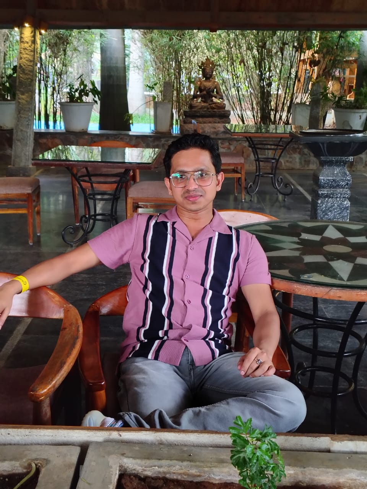

---
hide:
  - toc
  - navigation
---
<!--
CHECKLIST FOR THIS PAGE:
- [ ] Replace [YOUR NAME] with your full name (3 places)
- [ ] Replace [YOUR JOB TITLE] with your current or target role
- [ ] Replace [YOUR TAGLINE] with a short phrase describing your focus
- [ ] Rewrite the About Me paragraph with your own words
- [ ] Replace assets/images/profile.png with your actual photo (keep the filename or update it below)
- [ ] Replace assets/images/about.png with your own image (a field photo, map, or workspace shot)
- [ ] Edit the skill cards to match your actual skills (add, remove, or rename cards as needed)
- [ ] Update GitHub and LinkedIn links in the Connect section
- [ ] Add your CV PDF to docs/assets/ and update the filename in the Download CV button
-->

  
  <h1>Bikram Biswas</h1>
  
<strong>GIS ANALYST I</strong>

  
<em>[Turning spatial data into insights | GIS | Remote Sensing | Python | SQL]</em>

---

## About Me

I am Bikram Biswas, a GIS professional with expertise in geospatial data management, spatial analysis, remote sensing, and GIS-based decision support systems. With a Master's degree in Geographic Information Systems (GIS) from Bangalore University and hands-on industry experience across geospatial projects, I specialize in transforming complex spatial data into actionable insights for planning, asset management, and location-based decision-making.

My professional journey includes working on spatial data digitization, georeferencing, database management, land record mapping, web GIS applications, mobile GIS data collection, and GIS training programs. I have successfully contributed to projects involving cadastral mapping, deed plot digitization, CRM tract development, DGPS-based surveys, and interactive web mapping solutions while maintaining high standards of data quality and accuracy.

I am proficient in industry-leading geospatial technologies including ArcGIS Pro, QGIS, ERDAS Imagine, ArcGIS Online, AutoCAD Map 3D, ODK Collect, QField, SQL, and Google Earth Pro. My approach combines technical expertise, analytical thinking, and effective stakeholder communication to deliver reliable geospatial solutions for diverse business and organizational needs.

Beyond technical execution, I am passionate about knowledge sharing and have trained students, interns, and professionals from reputed institutions such as Bangalore University, BMS College of Engineering, St. Joseph's University, Mount Carmel College, and NIE Mysore in GIS concepts and applications.

Currently, I am seeking opportunities as a GIS Analyst, Geospatial Analyst, GIS Specialist, Spatial Data Analyst, or Remote Sensing Professional where I can leverage my technical expertise, project experience, and passion for geospatial technologies to support innovative and data-driven solutions.

  

---

[View My Projects :material-arrow-right:](projects/index.md){ .md-button .md-button--primary }
[Download CV :material-download:](assets/BikramBiswas-CV.pdf){ .md-button }

---

## Skills

-   :material-layers:{ .lg .middle } **GIS & Remote Sensing**

    ---

    - QGIS, ArcGIS Pro, Google Earth Engine
    - GDAL / OGR, GRASS GIS
    - Multispectral and SAR image analysis
    - Cloud Native Geospatial (COG, STAC, Zarr)

-   :material-code-braces:{ .lg .middle } **Programming**

    ---

    - Python — GeoPandas, NumPy, Pandas, Matplotlib
    - R — sf, terra, ggplot2
    - JavaScript — Leaflet, MapLibre GL
    - SQL, PostgreSQL + PostGIS

-   :material-star-four-points:{ .lg .middle } **Machine Learning & GeoAI**

    ---

    - Supervised classification — Random Forest, XGBoost
    - Deep learning for image segmentation — U-Net, SAM
    - scikit-learn, PyTorch, TensorFlow
    - Object detection in satellite imagery

-   :material-earth:{ .lg .middle } **Web Mapping & Data**

    ---

    - Leaflet.js, Folium, MapLibre GL JS
    - Cloud storage — AWS S3, Google Cloud Storage
    - Data formats — GeoTIFF, GeoParquet, NetCDF
    - Streamlit for data-driven web apps

-   :material-database:{ .lg .middle } **Data & Cloud**

    ---

    - PostgreSQL + PostGIS
    - Cloud storage: AWS S3, Google Cloud Storage
    - Data formats: GeoJSON, GeoTIFF, NetCDF, Zarr, GeoParquet

-   :material-airplane:{ .lg .middle } **Drone / UAV Data Processing**

    - Mission planning and flight operations
    - Photogrammetry: Agisoft Metashape, OpenDroneMap
    - Point cloud processing: CloudCompare, PDAL

---

## Connect

[GitHub](https://github.com/bikram0897){ .md-button }
[LinkedIn](https://linkedin.com/in/bikramgis408){ .md-button }
